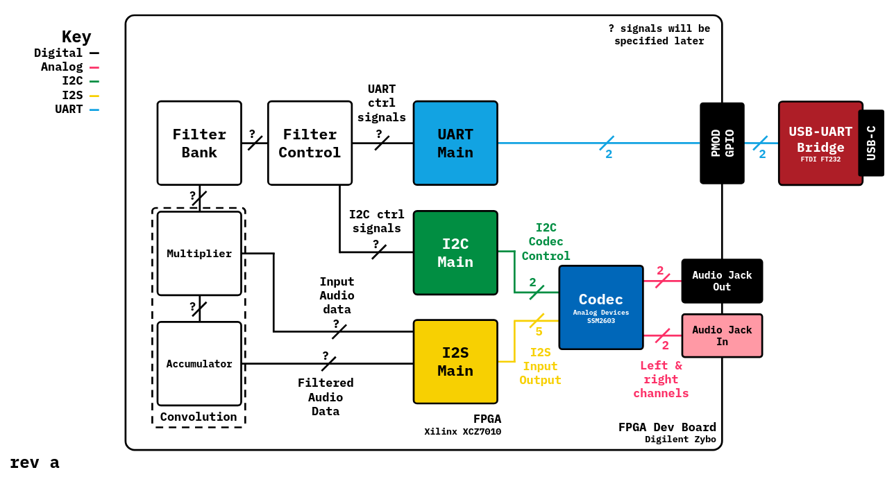

# Finite Impulse Response Filter FPGA Implementation

This project is a work in progress!

- [x] UART
- [x] I2S
- [x] I2C
- [] Multiplier
- [] Accumulator
- [] Filter control

## Running Tests

Tests are run through cocotb. Accordingly, a Python virtual envrionment is provided, which can be set up by sourcing the setup script `scripts/setup.sh`. Poetry and Pyenv are required for setup.

To run tests on a module, run `make module.test` from the root of the project directory.

## Synthesizing Modules

To synthesize a module, run `make module.bit` from the root of the project directory. This will create the associated bitstream in `bit/`. Vivado is used as the synthesis compiler to target Xilinx FPGAs. This project uses the Digilent Zybo development board with the XCZ7010 FPGA.

## Programming

To program, run `make module.program` from the root of the project directory.
